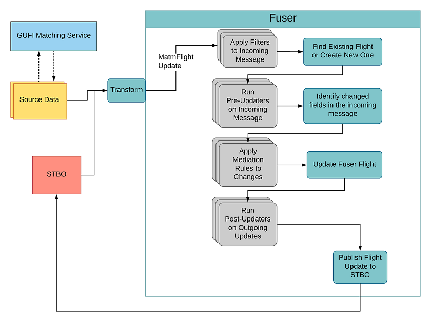

# Overview
---

The Fuser aggregates flight data from multiple FAA sources, Airline data, and 
3rd party data into a unified source. Flight information is organized by 
individual flights (one take-off and one landing) using the Globally Unique 
Flight Identifier (GUFI). As new messages are received, the flight file is 
updated. Clean and accurate data is assured through the use of transformation 
and mediation processes which enforce business rules on the received data. For 
additional details see the [NASA ATD-2 Industry Workshop Fuser Architecture Overview](https://aviationsystems.arc.nasa.gov/atd2-industry-workshop/fuser/Fuser-Architecture-Overview_84377881.html) 
  
>**Fuser Archicture Diagram**  
>


## Data Mappings
---

Data mapping representing the set of available flight fields produced by the 
Fuser and how those fields map to SWIM data can be found at 
[NASA ATD-2 Industry Workshop Data Dictionary](https://aviationsystems.arc.nasa.gov/atd2-industry-workshop/fuser/Fuser-Data-Dictionary_92471950.html)
and
[NASA ATD-2 Industry Workshop Fuser Database Input Mapping Table](https://aviationsystems.arc.nasa.gov/atd2-industry-workshop/fuser/Fuser-Database-Input-Mapping-Table_85328219.html)


## Configuration
---

The Fuser is highly configurable allowing for customization of attribute
filters, mediation rules, updaters, and message endpoints.  All property files 
are located under *src/main/resources/config/fuser* directory.

  
| Configuration | Location | Description |
|---|---|---|
| Default | properties.props | Default properties file containing definitions which affect the Fuser behavior. Definitions are store in *key=value* pairings. These definitions include but are not limited to: broker URL's,  logging behavior, active updaters, which data sources are active, etc. |
| Attribute Filters | /attributes/attributes.xml | XML file containing sets of *attributeFilter* elements grouped by arrival/departure category. Each *attributeFilter* element contains attributes defining the source and type (exclusion/inclusion) of filter applied to the nested set of flight elements. Additional information about attribute filters can be found at [NASA ATD-2 Industry Workshop Fuser Filtering Overview](https://aviationsystems.arc.nasa.gov/atd2-industry-workshop/fuser/Fuser-Filtering-Overview_85328206.html) |
| Mediation Rules | rules.properties.props beans.rules.xml | The *beans.rules.xml* Spring context defines the set of mediation rules which may be applied to  messages received by the Fuser.  Each bean definition represents a mediation rule determining how  specific flight fields are handled given a list of allowable sources.  The *rules.properties.props* file defines *key=value* pairings for controlling which mediation rules  are active and the priority for which mediation rules should be interpreted.  Additional information about mediation rules can be found at [NASA ATD-2 Industry Workshop Data Mediation Overview](https://aviationsystems.arc.nasa.gov/atd2-industry-workshop/fuser/Data-Mediation-Overview_85328193.html) |
| Messaging | topics.properties.props | Collection of *key=value* pairings defining the JMS routing of data through the Fuser.  Notable  properties in this file are:   - fuser.endpoint.fromFuser.fused  - fuser.endpoint.fromFuser.envelope.fused  - fuser.endpoint.fromFuser.remove  The above listed properties control the JMS topics used for distributed Fused data to downstream  applications. |
| Environment | src/main/resources/env | Environment property files provide support for easily running the Fuser in different environments  (e.g. production, development, test) without having to repeatedly reconfigure several different files.  An environment file may contain a subset of properties defined in *key=value* pairings which will  override other properties contained in: properties.props, rules.properties.props, and topics.properties.props. |

## Installation
---

The Fuser depends on Apache Maven 3.5.4 or higher and requires Java 8 to compile
all sources. As part of the Maven build process a deploy ready zip artifact will 
be generated.
  
From the root directory of the Fuser project execute: *mvn clean install*
  
The following artifacts should be produced:
  
 - Fuser.jar: JAR file containing the compiled binary representation of the Fuser
 - Fuser-bin.zip: Compressed artifact containing all of the dependencies, configurations, and
scripts required to run the Fuser as a stand-alone application
 - Fuser-resources.zip: Compressed artifact containing only the Fuser configuration files


## Execution
---

Complete the [Installation](#Installation) steps as execution requires the 
Fuser-bin.zip artifact generated as part of the installation.  Execution
requires that a Java 8 JRE be installed on the target system.  Steps to execute 
the Fuser as a stand-alone application are:

1.  Unzip the Fuser-bin.zip artifact.  This should result in a directory structure
similar to:
  
>```
>Fuser
>   |--/config        : contains all property and configuration files
>   |--/env           : contains environment property overrride files
>   |--/lib           : contains all required dependencies
>   |--/plugins       : contains plugins for consuming data sources
>   |--redis-utils
>   |--runFuser
>   |--runFuser.bat
>```
  
2. Make any modifications to the Fuser configuration as outlined in the 
[Configuration](#Configuration) section.  Note that all configuration files
are available under the */config* directory.
  
3. Execute the *./runFuser [environment property name]* where 
*environment property name* refers to the name of a specific property file 
located in the */env* directory which will be used to override any default
configurations.  If no environment property name is
provided the default configurations will be used.


## License
---
This software is released under the [NASA Open Source Agreement Version 1.3](license.pdf)

## Notices
---
Copyright © 2020 United States Government as represented by the Administrator of the National Aeronautics and Space Administration.  All Rights Reserved.

  
## Disclaimers
---
No Warranty: THE SUBJECT SOFTWARE IS PROVIDED "AS IS" WITHOUT ANY WARRANTY OF ANY KIND, EITHER EXPRESSED, IMPLIED, OR STATUTORY, INCLUDING, BUT NOT LIMITED TO, ANY WARRANTY THAT THE SUBJECT SOFTWARE WILL CONFORM TO SPECIFICATIONS, ANY IMPLIED WARRANTIES OF MERCHANTABILITY, FITNESS FOR A PARTICULAR PURPOSE, OR FREEDOM FROM INFRINGEMENT, ANY WARRANTY THAT THE SUBJECT SOFTWARE WILL BE ERROR FREE, OR ANY WARRANTY THAT DOCUMENTATION, IF PROVIDED, WILL CONFORM TO THE SUBJECT SOFTWARE. THIS AGREEMENT DOES NOT, IN ANY MANNER, CONSTITUTE AN ENDORSEMENT BY GOVERNMENT AGENCY OR ANY PRIOR RECIPIENT OF ANY RESULTS, RESULTING DESIGNS, HARDWARE, SOFTWARE PRODUCTS OR ANY OTHER APPLICATIONS RESULTING FROM USE OF THE SUBJECT SOFTWARE.  FURTHER, GOVERNMENT AGENCY DISCLAIMS ALL WARRANTIES AND LIABILITIES REGARDING THIRD-PARTY SOFTWARE, IF PRESENT IN THE ORIGINAL SOFTWARE, AND DISTRIBUTES IT "AS IS."
  
Waiver and Indemnity:  RECIPIENT AGREES TO WAIVE ANY AND ALL CLAIMS AGAINST THE UNITED STATES GOVERNMENT, ITS CONTRACTORS AND SUBCONTRACTORS, AS WELL AS ANY PRIOR RECIPIENT.  IF RECIPIENT'S USE OF THE SUBJECT SOFTWARE RESULTS IN ANY LIABILITIES, DEMANDS, DAMAGES, EXPENSES OR LOSSES ARISING FROM SUCH USE, INCLUDING ANY DAMAGES FROM PRODUCTS BASED ON, OR RESULTING FROM, RECIPIENT'S USE OF THE SUBJECT SOFTWARE, RECIPIENT SHALL INDEMNIFY AND HOLD HARMLESS THE UNITED STATES GOVERNMENT, ITS CONTRACTORS AND SUBCONTRACTORS, AS WELL AS ANY PRIOR RECIPIENT, TO THE EXTENT PERMITTED BY LAW.  RECIPIENT'S SOLE REMEDY FOR ANY SUCH MATTER SHALL BE THE IMMEDIATE, UNILATERAL TERMINATION OF THIS AGREEMENT.


